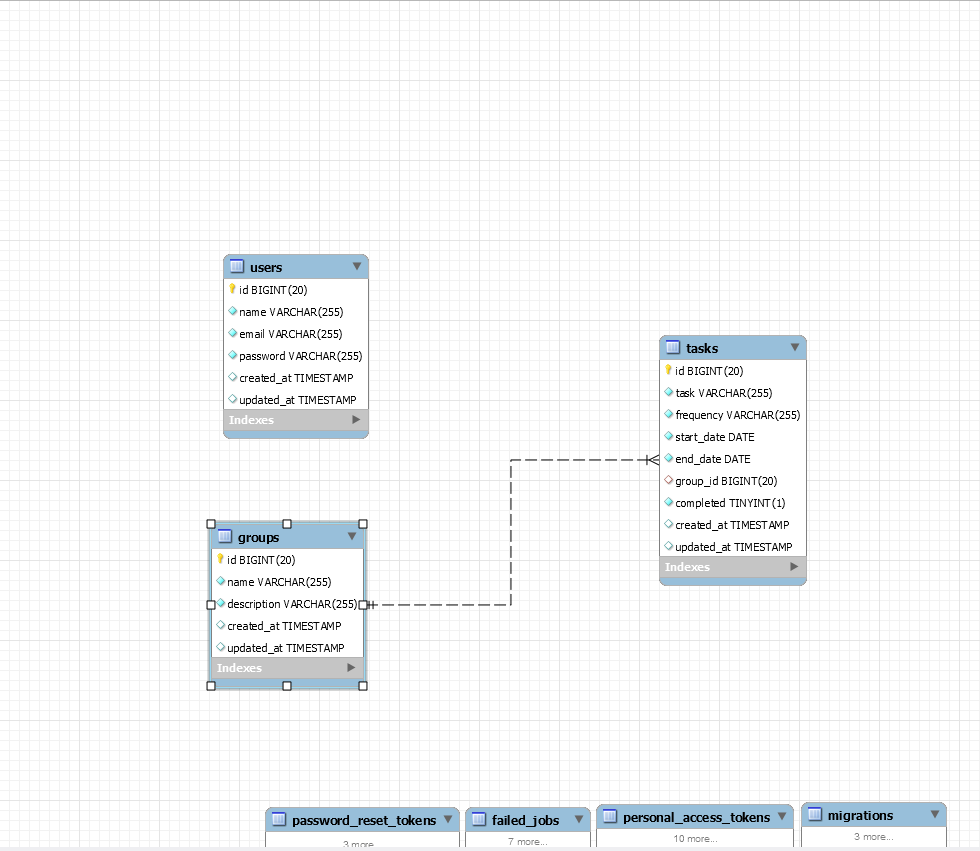
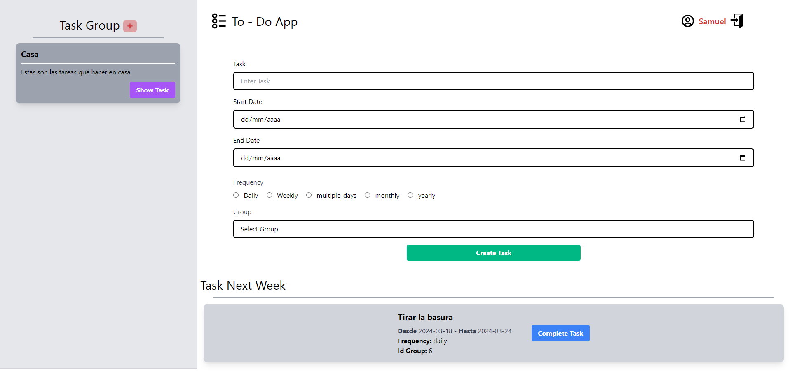

<p align="center"><a href="https://laravel.com" target="_blank"></a></p>


<p align="center"><a href="https://livewire.laravel.com/" target="_blank"></a></p>

<p align="center"><a href="https://tailwindcss.com/" target="_blank"></a></p>

<p align="center">
<a href="https://packagist.org/packages/laravel/framework"></a>
<a href="https://packagist.org/packages/laravel/framework"></a>
<a href="https://packagist.org/packages/laravel/framework"></a>
</p>

# Laravel Tailwind CSS & Livewire Project

Este es un proyecto el cual consiste en crear una página de tareas periódicas. Dichas tareas se van a poder agrupar en grupos. Al deberse de tareas periódicas, cuando se crean se asignan un rango de fechas y una frecuencia, por lo que mientras se esté en el rango establecido y dependiendo de la frecuencia, la tarea se volverá a poner como **no completada** gracias a los **jobs** de laravel.

## Descripción

Este proyecto utiliza las siguientes tecnologías:

- **Laravel**: Un framework de PHP para el desarrollo de aplicaciones web.
- **Tailwind CSS**: Un framework de CSS de utilidad que facilita la creación de interfaces de usuario estilizadas.
- **Livewire**: Una biblioteca de Laravel para la creación de interfaces de usuario interactivas sin JavaScript.

Se han escogido estas tecnologías porque con **Laravel** se pueden desarrollar webs complejas de una manera rápida, ordenada y sencilla, las plantillas de Blade proporcionan una capa de lógica integrada dentro de la vista. 

**Livewire** simplifica el desarrollo al permitir utilizar PHP para manejar la lógica del lado del servidor y reactividad del lado del cliente, sin tener que escribir JavaScript adicional. Se puede mantener la coherencia en el código, ya que Livewire sigue las convenciones de Laravel y utiliza la misma estructura y sintaxis que el framework. Esto facilita la comprensión y el mantenimiento del código a lo largo del tiempo.

El framework de CSS, **Tailwind** adopta un enfoque basado en clases para el diseño de interfaces de usuario, por lo que se puede mantener una apariencia y comportamiento consistentes en toda la aplicación. Las clases predefinidas y las convenciones de nomenclatura ayudan a garantizar que el diseño de la interfaz de usuario se mantenga coherente en todas las páginas y componentes.

## Diagrama de base de datos

En este diagrama se pueden apreciar 7 tablas, de las cuales las 4 de abajo vienen por defecto en los proyectos de Laravel.

La atención está puesta en las 3 del medio **(users,groups,tasks)**. La primera tabla users, va a almacenar los usuarios que se registren en la página web, la tabla tasks va a almacenar las tareas que se vayan creando y la tabla groups los grupos que se vayan creado.

La relación que se puede ver en el diagrama es de **uno a muchos** porque un solo registro en la tabla de grupos puede tener múltiples registros relacionados en la tabla de tareas, pero cada registro en la tabla de tareas solo puede estar asociado a un único registro en la tabla de grupos, esto se implementa mediante la colocación de una clave foránea en la tabla de tareas que hace referencia a la clave primaria de la tabla de grupos.

> **Nota:** Teniendo en cuenta esta relación, solo se va a poder **eliminar un grupo** si no tiene ninguna tarea asociada al mismo.

## Decisiones de diseño


El diseño de la web es minimalista, cuando el usuario inicia sesión, ve de un vistazo las opciones que tiene tanto para crear un grupo como para crear una tarea. Se han escogido colores que representen muy bien la utilidad de cada componente. Gracias a las sesiones flash de Laravel se puede informar a los usuarios de una manera sencilla cuando tienen algún error al iniciar sesión, crear grupos o tareas. Esto es una parte fundamental del diseño.

## Requisitos Previos

- PHP >= 7.4
- Composer
- MySQL
- Node.js
- NPM o Yarn

## Instalación y puesta en marcha

1. Clonar este repositorio en tu máquina local

   ```bash
   git clone https://github.com/Samuelrobdia/TodoList.git

2. Instalar las dependencias PHP
    ```bash
    composer install

3. Instalar las dependencias Node.js
    ```bash
    npm install o yarn install

4. Copiar el archivo de entorno y crear la clave de aplicación
    ```bash
    cp .env.example .env
    php artisan key:generate

5. Configurar las credenciales de la base de datos y crear la misma
   ```bash
    DB_CONNECTION=mysql
    DB_HOST=127.0.0.1
    DB_PORT=3306
    DB_DATABASE=todolist
    DB_USERNAME={{user}}
    DB_PASSWORD={{password}}
    ```
    ```bash
    CREATE DATABASE todolist;

6. Ejecutar las migraciones
   ```bash
   php artisan migrate 

7. Iniciar el servidor de vite
    ```bash
    npm run dev

8. Iniciar el servidor de desarrollo
   ```bash
   php artisan serve

9. Visitar la URL 
    ```bash
    http://localhost:8000
